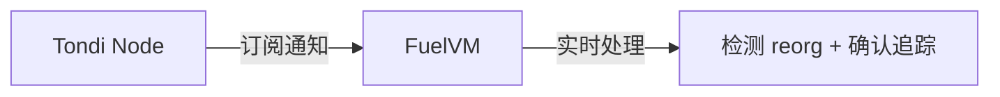
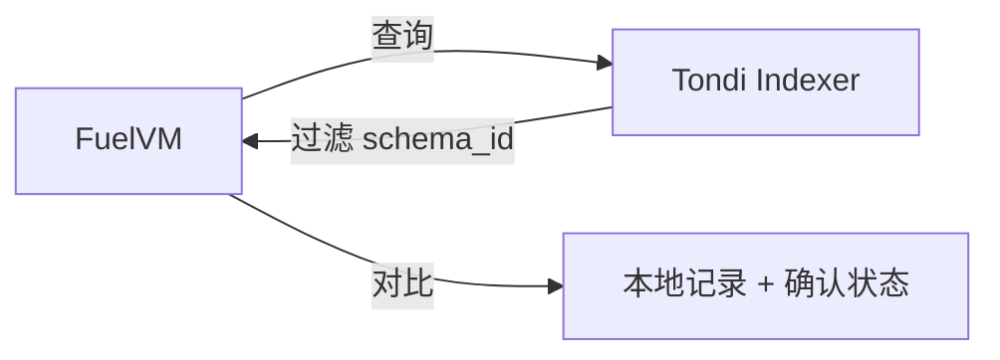
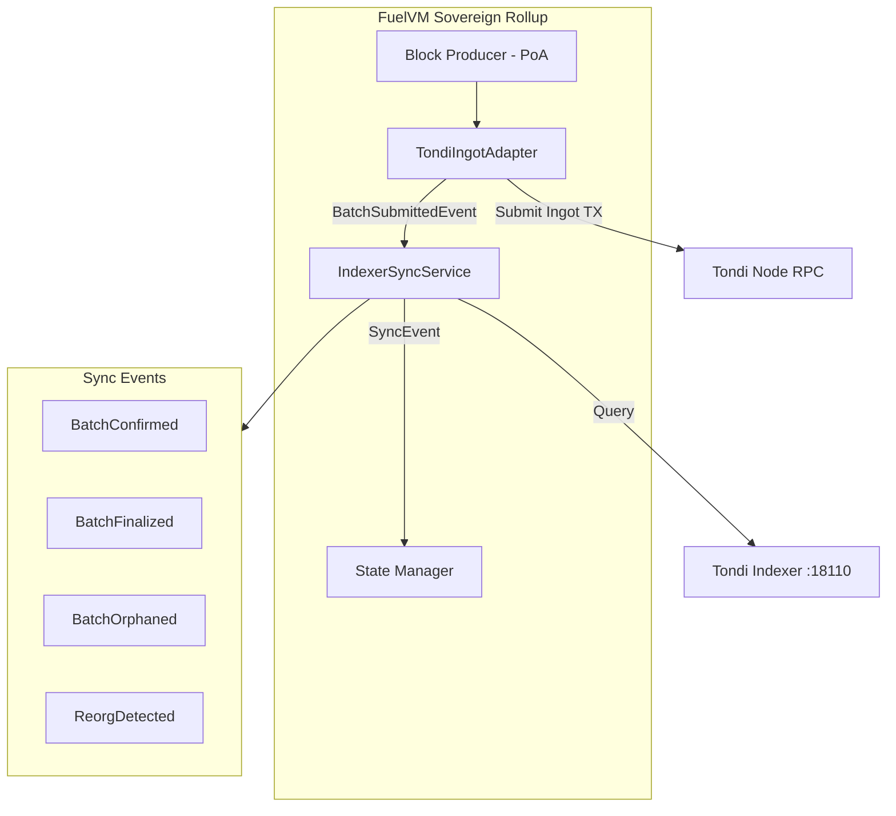
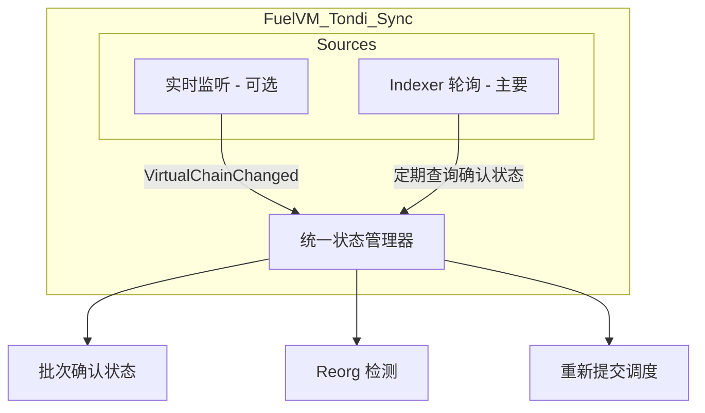
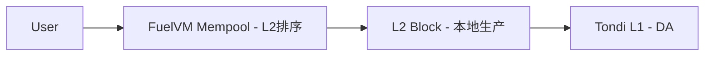
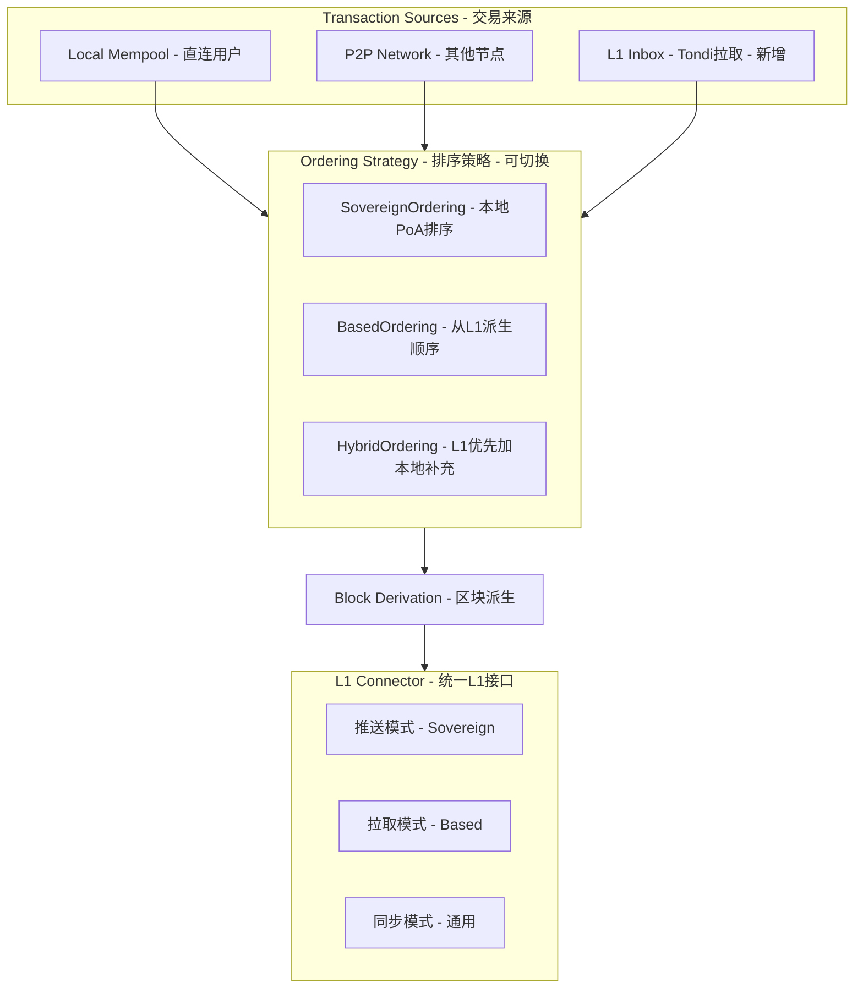
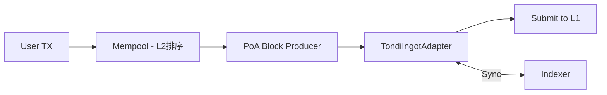
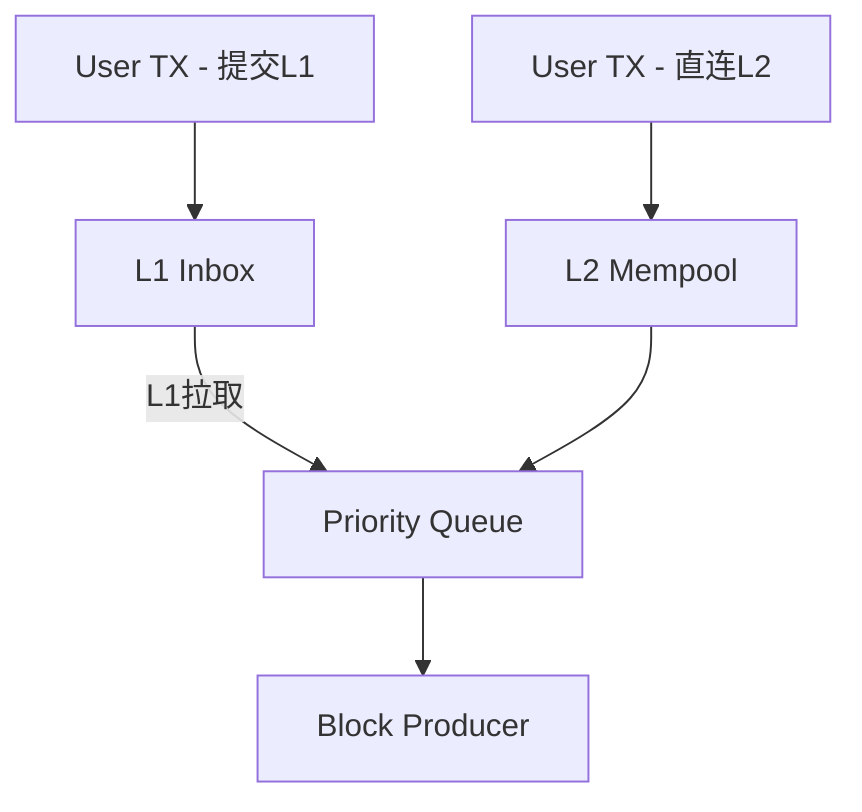
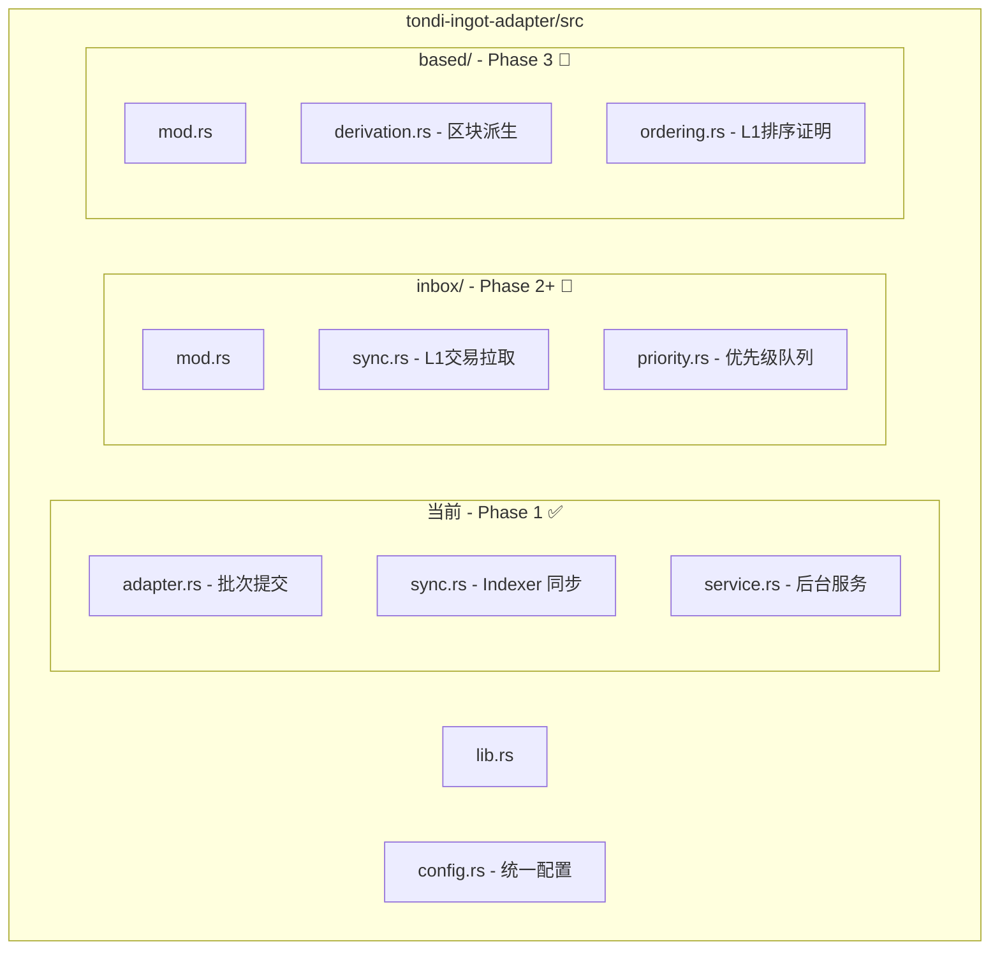

# L1-L2 Reorg-Proof Sync Paradigms

> **实现状态**: ✅ 方案 B 已实现
> 
> 代码位置: `crates/services/tondi-ingot-adapter/src/sync.rs`

## 方案对比

### 方案 A：VirtualChainChanged 通知监听 - 主动推送



### 方案 B：Ingot Indexer 查询 - 被动拉取 ✅ 已实现



---

## 关键差异

| 维度 | 通知监听 - 方案 A | Indexer 查询 - 方案 B |
|----|----|----| 
| **实时性** | 实时，毫秒级 | 轮询延迟，秒级 |
| **复杂度** | 需要处理通知流、状态机 | 简单的 REST/gRPC 查询 |
| **Reorg 检测** | 主动通知 removed_chain_block_hashes | 需要对比历史记录推断 |
| **依赖** | 需要 WebSocket/gRPC 订阅连接 | 只需 HTTP 查询 |
| **恢复能力** | 断线后需要重新同步 | 无状态，随时可查 |
| **幂等性** | 需要自己维护 | Indexer 天然幂等 |

---

## ✅ 已实现: Indexer 方案 (方案 B)

### 实现架构



### 核心组件

| 组件 | 文件 | 职责 |
|------|------|------|
| `SyncConfig` | `config.rs` | 同步配置（轮询间隔、超时等） |
| `TondiIndexerClient` | `ports.rs` | Indexer RPC 抽象接口 |
| `IndexerSyncService` | `sync.rs` | 同步服务主逻辑 |
| `ConfirmationLevel` | `sync.rs` | 确认状态枚举 |
| `SyncEvent` | `sync.rs` | 同步事件通知 |

### 实现代码

```rust
// crates/services/tondi-ingot-adapter/src/config.rs
/// L1-L2 同步配置
pub struct SyncConfig {
    /// Indexer RPC 地址 (默认: http://localhost:18110)
    pub indexer_url: Url,
    /// 轮询间隔 (默认: 3秒)
    pub poll_interval: Duration,
    /// 孤立批次超时 (默认: 45秒)
    pub orphan_timeout: Duration,
    /// 最大重试次数 (默认: 3)
    pub max_resubmit_attempts: u8,
    /// 最终确认数 (默认: 10 DAA score)
    pub finality_confirmations: u64,
    /// 是否启用同步
    pub enabled: bool,
}

// crates/services/tondi-ingot-adapter/src/sync.rs
/// 确认级别
pub enum ConfirmationLevel {
    NotFound,                           // 未找到
    Pending,                            // 在 mempool
    Included { daa_score, confirmations }, // 已包含，等待确认
    Finalized { daa_score },            // 已最终确认
    Orphaned,                           // 已孤立
}

/// 同步事件
pub enum SyncEvent {
    BatchConfirmed { batch_number, instance_id, daa_score },
    BatchFinalized { batch_number, instance_id, daa_score },
    BatchOrphaned { batch_number, tx_id, reason },
    ReorgDetected { reorg_daa_score, affected_count },
}

/// Indexer 同步服务
pub struct IndexerSyncService<I, D> {
    config: SyncConfig,
    indexer: I,                         // TondiIndexerClient 实现
    database: Arc<D>,                   // 提交数据库
    schema_id: [u8; 32],               // FuelVM schema ID
    last_confirmed_daa_score: Mutex<u64>,
    pending_batches: Mutex<HashMap<u64, SubmittedBatchTracker>>,
}

impl<I, D> IndexerSyncService<I, D> {
    /// 同步一次迭代
    pub async fn sync_once(&self) -> Result<Vec<SyncEvent>> {
        // 1. 获取 Indexer 状态
        let stats = self.indexer.get_stats().await?;
        
        // 2. 查询已确认的 FuelVM 批次
        let options = IndexerQueryOptions::for_fuel_batches(
            self.schema_id,
            Some(self.last_confirmed_daa_score),
        );
        let confirmed = self.indexer.query_transactions(options).await?;
        
        // 3. 处理确认的批次
        for ingot in confirmed {
            self.process_confirmed_ingot(&ingot, stats.current_daa_score).await?;
        }
        
        // 4. 检查孤立批次
        self.check_orphaned_batches().await?
    }
}
```

### 使用方式

```rust
use fuel_core_tondi_ingot_adapter::{
    Config, SyncConfig, new_service_with_sync,
};

// 创建带同步的服务
let config = Config::new(rpc_url)
    .with_sync(SyncConfig {
        indexer_url: "http://localhost:18110".parse()?,
        poll_interval: Duration::from_secs(3),
        orphan_timeout: Duration::from_secs(45),
        finality_confirmations: 10,
        ..Default::default()
    });

let service = new_service_with_sync(
    config,
    rpc_client,
    signer,
    Arc::new(database),
    indexer_client,
)?;
```

---

## 原设计参考

以下是原始设计文档，供参考：

```rust
/// 基于 Indexer 的同步服务 (原设计)
pub struct TondiIndexerSync {
    /// Tondi RPC 客户端
    tondi_rpc: TondiRpcClient,
    /// FuelVM 的 schema_id
    schema_id: Hash,
    /// 最后确认的批次号
    last_confirmed_batch: u64,
    /// 轮询间隔
    poll_interval: Duration,
}

impl TondiIndexerSync {
    /// 同步循环
    async fn sync_loop(&mut self) -> anyhow::Result<()> {
        loop {
            // 1. 查询 Indexer：获取所有 confirmed 的 FuelVM Ingot
            let confirmed_ingots = self.tondi_rpc
                .get_ingots_by_schema(
                    &self.schema_id,
                    self.last_confirmed_batch + 1,
                    None,
                    ConfirmationLevel::Finalized,
                )
                .await?;
            
            // 2. 处理确认的批次
            for ingot in confirmed_ingots {
                let batch_num = self.extract_batch_number(&ingot)?;
                self.mark_batch_finalized(batch_num, ingot.block_hash)?;
                self.last_confirmed_batch = batch_num;
            }
            
            // 3. 检查是否有未确认的批次
            self.check_orphaned_batches().await?;
            
            tokio::time::sleep(self.poll_interval).await;
        }
    }
    
    /// 检查孤立批次
    async fn check_orphaned_batches(&mut self) -> anyhow::Result<()> {
        let pending_batches = self.storage.get_pending_batches()?;
        
        for batch in pending_batches {
            if batch.submitted_at.elapsed() > self.orphan_timeout {
                match self.tondi_rpc.get_transaction_status(batch.txid).await? {
                    TxStatus::NotFound => {
                        self.schedule_resubmission(batch.batch_number).await?;
                    }
                    TxStatus::InMempool => {}
                    TxStatus::Rejected(reason) => {
                        tracing::error!(batch = batch.batch_number, %reason, "Batch rejected");
                        self.schedule_resubmission(batch.batch_number).await?;
                    }
                    _ => {}
                }
            }
        }
        Ok(())
    }
}
```

---

## 两种方案可以结合

实际上，最稳健的设计是 **结合两种方案**：



**分工**：

* **Indexer 轮询**：主要确认机制，可靠、无状态、易于实现
* **通知监听**：可选的优化，用于快速 reorg 检测

---

## ✅ 推荐方案 (已实现)

对于 **MVP 阶段**，使用 **Indexer 方案**，因为：

1. **实现简单**：只需 HTTP 查询，无需维护 WebSocket 连接
2. **恢复容易**：节点重启后直接从 Indexer 同步
3. **调试方便**：可以手动查询 Indexer 验证状态
4. **依赖少**：不需要 Tondi 的通知订阅功能

### 默认配置值

```rust
// crates/services/tondi-ingot-adapter/src/config.rs
impl SyncConfig {
    /// 默认轮询间隔 (3秒)
    pub const DEFAULT_POLL_INTERVAL: Duration = Duration::from_secs(3);
    /// 默认孤立超时 (45秒)
    pub const DEFAULT_ORPHAN_TIMEOUT: Duration = Duration::from_secs(45);
    /// 默认最大重试次数 (3次)
    pub const DEFAULT_MAX_RESUBMIT_ATTEMPTS: u8 = 3;
    /// 默认最终确认数 (10 DAA score)
    pub const DEFAULT_FINALITY_CONFIRMATIONS: u64 = 10;
}
```

### 配置说明

| 配置项 | 默认值 | 说明 |
|--------|--------|------|
| `poll_interval` | 3s | 轮询 Indexer 的间隔，建议 2-6 秒 |
| `orphan_timeout` | 45s | 认为批次孤立的超时时间，建议 30-60 秒 |
| `max_resubmit_attempts` | 3 | 最大重试次数 |
| `finality_confirmations` | 10 | 认为已最终确认的 DAA score 差值 |
| `indexer_url` | localhost:18110 | Tondi Indexer RPC 地址 |

---

# Sovereign → Based Rollup 演进路径

## 两种模式的核心差异

### Sovereign Rollup - 现阶段



**特点**：L2 完全控制排序，L1 只存数据

### Based Rollup - 未来


**特点**：L1 决定交易顺序，L2 是派生链

---

## 渐进式架构设计



---

## 核心抽象接口

```rust
/// 排序模式
#[derive(Debug, Clone, Copy)]
pub enum OrderingMode {
    /// Sovereign: L2 完全控制排序
    Sovereign,
    /// Based: L1 决定排序
    Based,
    /// Hybrid: L1 优先，允许 L2 补充
    Hybrid { 
        l1_priority: bool,
        l2_fallback_timeout: Duration,
    },
}

/// 交易来源
#[derive(Debug, Clone)]
pub enum TransactionSource {
    /// 本地 mempool
    LocalMempool,
    /// P2P 网络
    P2PGossip,
    /// L1 Inbox - Based Rollup 使用
    L1Inbox { l1_block: u64, l1_tx_index: u32 },
}

/// 排序提供者 trait - 核心抽象
#[async_trait]
pub trait OrderingProvider: Send + Sync {
    async fn get_pending_transactions(&self) -> Vec<(Transaction, TransactionSource)>;
    fn get_ordering_proof(&self) -> OrderingProof;
    fn mode(&self) -> OrderingMode;
}

/// L1 连接器 trait - 统一接口
#[async_trait]
pub trait L1Connector: Send + Sync {
    // 推送模式 - Sovereign
    async fn submit_batch(&self, batch: &FuelBlockBatch) -> Result<L1TxId>;
    async fn get_batch_status(&self, batch_id: u64) -> Result<BatchL1Status>;
    
    // 拉取模式 - Based
    async fn get_inbox_transactions(
        &self,
        from_l1_height: u64,
        to_l1_height: Option<u64>,
    ) -> Result<Vec<L1InboxTransaction>>;
    async fn get_l1_state(&self) -> Result<L1State>;
    
    // 通用
    async fn sync_to_height(&self, height: u64) -> Result<()>;
}
```

---

## 三阶段演进计划

### Phase 1: Pure Sovereign - ✅ 已实现



**实现文件**:
- `adapter.rs` - 批次提交逻辑
- `sync.rs` - L1 确认同步 (Plan B)
- `service.rs` - 后台服务

**功能**:
- ✅ 批量提交 FuelVM 区块到 Tondi L1
- ✅ TLV 格式的 Ingot payload 编码
- ✅ Indexer 轮询确认追踪
- ✅ 孤立批次检测和重提交调度
- ✅ DAA score 确认计数
- ⚠️ Reorg 检测 (基础实现)
- ⚠️ 实际重提交 (需要 Block Producer 配合)

### Phase 2: Hybrid Mode - 过渡阶段



**新增**: L1InboxSync 服务  
**功能**: 从 L1 拉取用户直接提交的 FuelVM 交易  
**优先级**: L1 交易优先处理，确保 Based 语义

### Phase 3: Pure Based - 最终目标


**实现**: TondiDerivationPipeline  
**功能**: 从 L1 派生区块，完全基于 L1 排序

---

## L1 Inbox 设计 - 为 Based 模式准备

```rust
/// L1 Inbox 交易格式 - 用户直接提交到 Tondi 的 FuelVM 交易
pub struct L1InboxTransaction {
    pub l1_block_height: u64,
    pub l1_tx_index: u32,
    pub l1_daa_score: u64,
    pub fuel_tx: Transaction,
    pub l1_sender: TondiAddress,
}

/// L1 Inbox 同步服务 - Phase 2/3 使用
pub struct L1InboxSync {
    tondi_connector: Arc<dyn L1Connector>,
    last_synced_l1_height: u64,
    pending_l1_txs: VecDeque<L1InboxTransaction>,
}

impl L1InboxSync {
    async fn sync(&mut self) -> anyhow::Result<Vec<L1InboxTransaction>> {
        let current_l1_height = self.tondi_connector.get_l1_state().await?.height;
        
        if current_l1_height > self.last_synced_l1_height {
            let new_txs = self.tondi_connector
                .get_inbox_transactions(
                    self.last_synced_l1_height + 1,
                    Some(current_l1_height),
                )
                .await?;
            
            self.last_synced_l1_height = current_l1_height;
            self.pending_l1_txs.extend(new_txs.clone());
            
            Ok(new_txs)
        } else {
            Ok(vec![])
        }
    }
}
```

---

## 配置驱动的模式切换

```rust
/// Tondi 集成配置
#[derive(Debug, Clone)]
pub struct TondiConfig {
    pub rpc_url: Url,
    pub ordering_mode: OrderingMode,
    pub sovereign: Option<SovereignConfig>,
    pub based: Option<BasedConfig>,
}

#[derive(Debug, Clone)]
pub struct SovereignConfig {
    pub submission_interval: Duration,
    pub max_batch_size: u32,
    pub finality_confirmations: u8,
}

#[derive(Debug, Clone)]
pub struct BasedConfig {
    pub l1_sync_delay_blocks: u64,
    pub inbox_schema_id: Hash,
    pub allow_local_txs: bool,
}
```

---

## CLI 参数设计

```bash
# Phase 1: Sovereign 模式 - 当前
fuel-core run \
  --enable-tondi \
  --tondi-mode sovereign \
  --tondi-submission-interval 12s

# Phase 2: Hybrid 模式 - 过渡
fuel-core run \
  --enable-tondi \
  --tondi-mode hybrid \
  --tondi-l1-priority \
  --tondi-allow-local-txs

# Phase 3: Based 模式 - 未来
fuel-core run \
  --enable-tondi \
  --tondi-mode based \
  --tondi-sync-delay-blocks 6 \
  --tondi-inbox-schema-id <hash>
```

---

## 文件结构

### 当前实现 (Phase 1)

```
crates/services/tondi-ingot-adapter/src/
├── lib.rs          # 模块导出
├── config.rs       # Config + SyncConfig 配置
├── adapter.rs      # TondiIngotAdapter 批次提交
├── sync.rs         # IndexerSyncService 确认同步 ✅
├── service.rs      # 后台服务 (RunnableService)
├── payload.rs      # TLV payload 编码
├── ports.rs        # 接口 traits (TondiRpcClient, TondiIndexerClient)
├── types.rs        # 类型定义 (BatchRecord, BatchL1Status)
├── storage.rs      # 提交数据库
└── error.rs        # 错误类型
```

### 未来扩展 (Phase 2/3)



---

## 总结

| 阶段 | 模式 | 主要实现 | 状态 |
|----|----|----|----|
| **Phase 1** | Sovereign | TondiIngotAdapter + IndexerSyncService | ✅ 已实现 |
| **Phase 2** | Hybrid | 新增 L1InboxSync 拉取 + 优先级 | 🔮 计划中 |
| **Phase 3** | Based | 新增 DerivationPipeline | 🔮 计划中 |

### Phase 1 实现清单

| 功能 | 状态 | 说明 |
|------|------|------|
| 批次提交 | ✅ | `TondiIngotAdapter.submit_batch()` |
| TLV payload | ✅ | `PayloadBuilder.encode_tlv()` |
| Indexer 轮询 | ✅ | `IndexerSyncService.sync_once()` |
| 确认追踪 | ✅ | `ConfirmationLevel` 状态机 |
| 孤立检测 | ✅ | `check_orphaned_batches()` |
| 事件通知 | ✅ | `SyncEvent` 枚举 |
| 重提交调度 | ⚠️ | 需要 Block Producer 配合 |

**关键设计原则**：

1. **接口抽象**：`TondiIndexerClient` 和 `TondiRpcClient` 隔离 L1 交互
2. **配置驱动**：`SyncConfig` 控制同步行为，无需代码改动
3. **增量实现**：Phase 1 完成后，Phase 2/3 是增量添加
4. **事件驱动**：`SyncEvent` 允许上层服务响应状态变化
