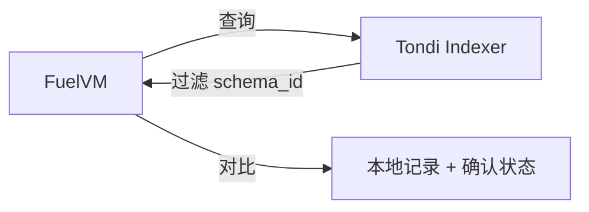
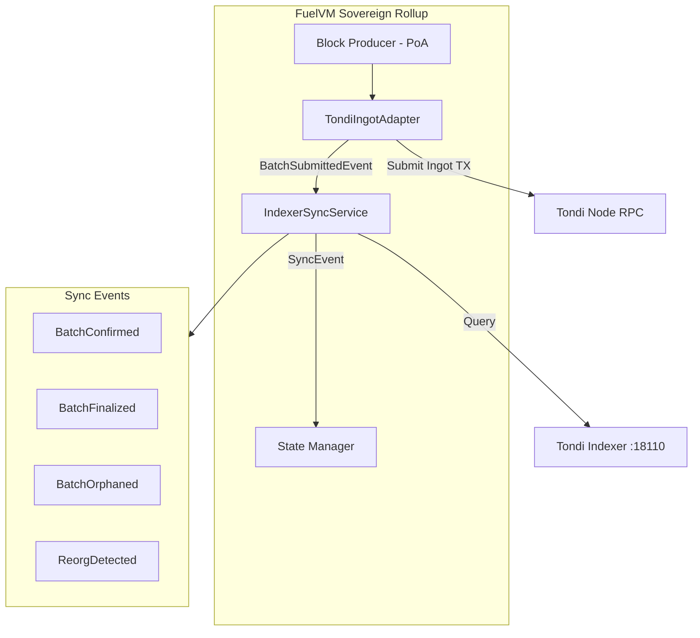
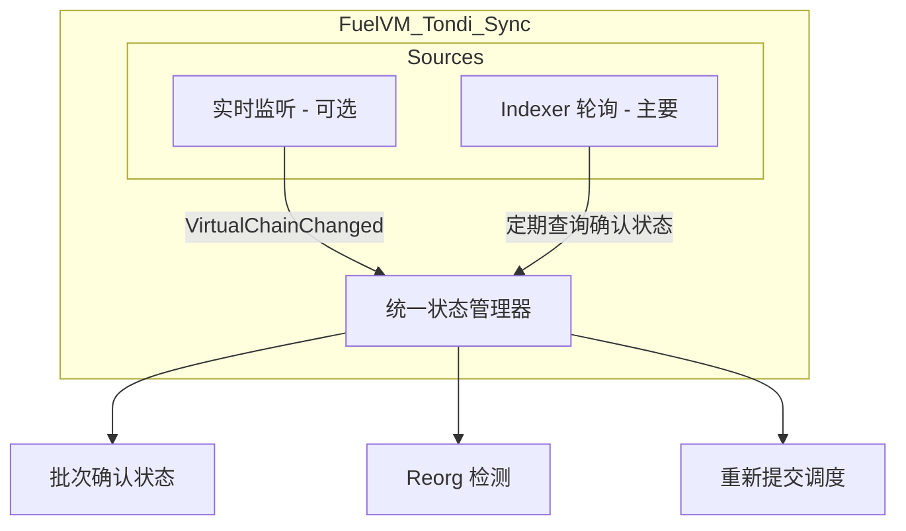
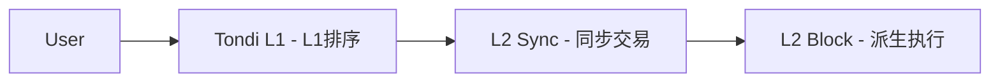
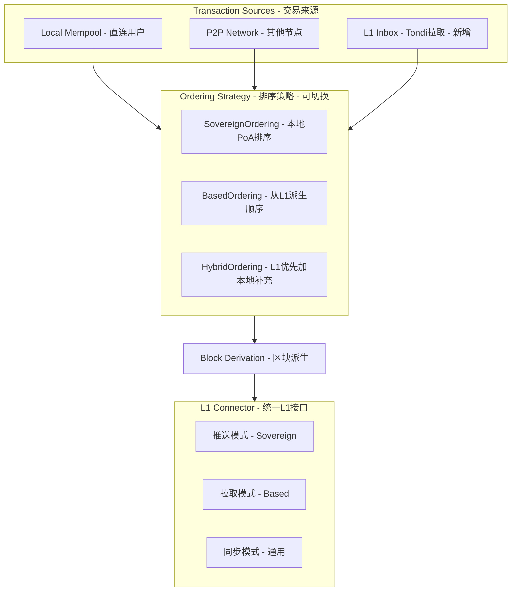
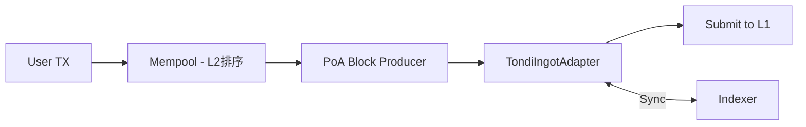
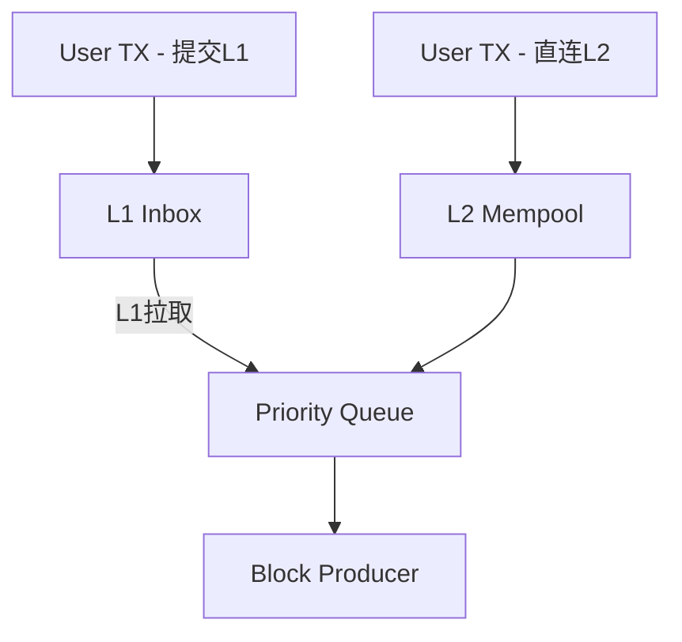
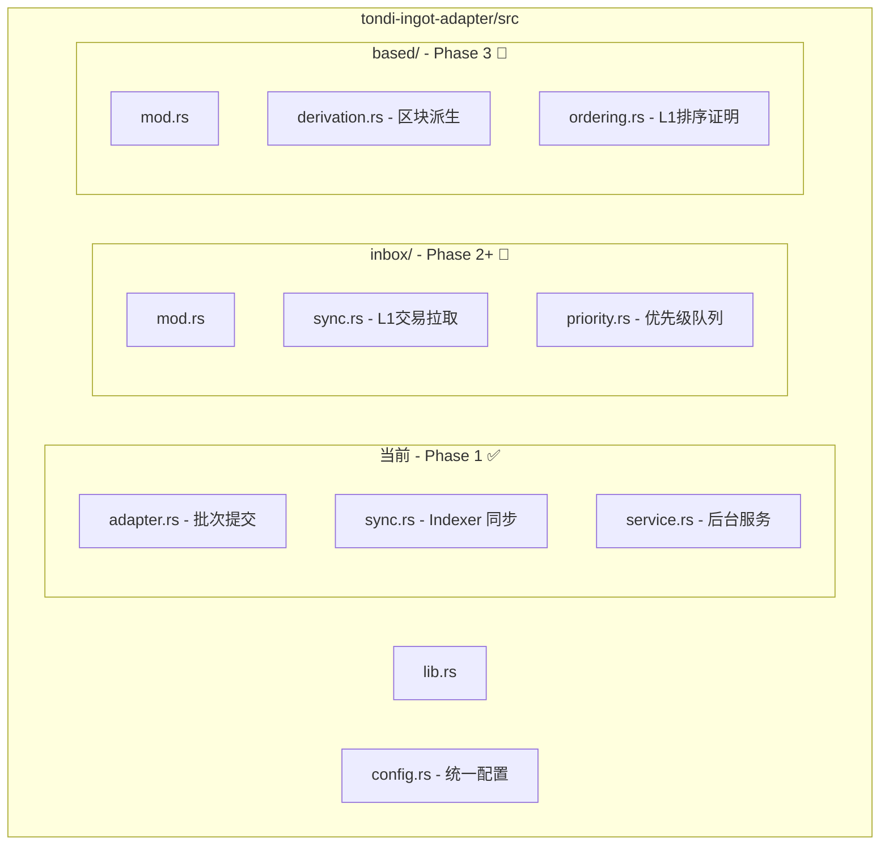

# L1-L2 Reorg-Proof Sync Paradigms

> **实现状态**: ✅ 方案 B 已实现
> 
> 代码位置: `crates/services/tondi-ingot-adapter/src/sync.rs`

## 方案对比

### 方案 A：VirtualChainChanged 通知监听 - 主动推送


### 方案 B：Ingot Indexer 查询 - 被动拉取 ✅ 已实现



---

## 关键差异

| 维度 | 通知监听 - 方案 A | Indexer 查询 - 方案 B |
|----|----|----| 
| **实时性** | 实时，毫秒级 | 轮询延迟，秒级 |
| **复杂度** | 需要处理通知流、状态机 | 简单的 REST/gRPC 查询 |
| **Reorg 检测** | 主动通知 removed_chain_block_hashes | 需要对比历史记录推断 |
| **依赖** | 需要 WebSocket/gRPC 订阅连接 | 只需 HTTP 查询 |
| **恢复能力** | 断线后需要重新同步 | 无状态，随时可查 |
| **幂等性** | 需要自己维护 | Indexer 天然幂等 |

---

## ✅ 已实现: Indexer 方案 (方案 B)

### 实现架构



### 核心组件

| 组件 | 文件 | 职责 |
|------|------|------|
| `Config` | `config.rs` | 提交配置（批次大小、间隔等） |
| `SyncConfig` | `config.rs` | 同步配置（轮询间隔、超时等） |
| `TondiRpcClient` | `ports.rs` | Tondi L1 RPC 抽象接口 |
| `TondiIndexerClient` | `ports.rs` | Indexer RPC 抽象接口 |
| `TondiSubmissionDatabase` | `ports.rs` | 提交记录数据库接口 |
| `IndexerSyncService` | `sync.rs` | 同步服务主逻辑 |
| `ConfirmationLevel` | `sync.rs` | 确认状态枚举 |
| `SyncEvent` | `sync.rs` | 同步事件通知 |
| `TondiIngotAdapter` | `adapter.rs` | 批次提交核心逻辑 |
| `PayloadBuilder` | `payload.rs` | TLV 格式 payload 构建与编解码 |
| `BatchHeader` | `types.rs` | 45 字节固定格式批次头 |
| `BatchRecord` | `types.rs` | 提交记录存储类型 |

### 完整数据流

```
┌─────────────────────────────────────────────────────────────────────┐
│                        L2 提交流程 (Sequencer)                        │
├─────────────────────────────────────────────────────────────────────┤
│                                                                     │
│  SealedBlock[N..M] ───> PayloadBuilder.build()                     │
│                              │                                      │
│                              ▼                                      │
│                    FuelBlockBatchPayload {                          │
│                      header: BatchHeader {                          │
│                        version: 1,                                  │
│                        start_height: N,                             │
│                        block_count: M-N+1,                          │
│                        parent_hash: blocks[0].prev_hash             │
│                      },                                             │
│                      blocks: [FuelBlockData...],                    │
│                      commitment: BatchCommitment                    │
│                    }                                                │
│                              │                                      │
│                              ▼                                      │
│                    PayloadBuilder.encode()                          │
│                              │                                      │
│                              ▼ payload_bytes                        │
│                    blake3(payload_bytes)                            │
│                              │                                      │
│                              ▼ hash_payload                         │
│                    IngotOutput {                                    │
│                      schema_id: blake3("fuelvm/batch/v1"),          │
│                      hash_payload,                                  │
│                      lock: PubKey { sequencer_pubkey }              │
│                    }                                                │
│                              │                                      │
│                              ▼                                      │
│                    compute_ingot_sig_msg() // ⚠️ Ingot-specific!    │
│                              │                                      │
│                              ▼ sig_msg                              │
│                    signer.sign(sig_msg) → 64-byte signature         │
│                              │                                      │
│                              ▼                                      │
│                    IngotWitness {                                   │
│                      payload: Some(payload_bytes),                  │
│                      auth_sigs: [signature] // ⚠️ 原始 64 字节!      │
│                    }                                                │
│                              │                                      │
│                              ▼                                      │
│                    Tondi Transaction                                │
│                      inputs[0].signature_script = Borsh(witness)    │
│                      outputs[0] = Pay2Ingot(ingot_output)           │
│                              │                                      │
│                              ▼                                      │
│                    Submit to Tondi L1                               │
│                                                                     │
└─────────────────────────────────────────────────────────────────────┘

┌─────────────────────────────────────────────────────────────────────┐
│                     L2 接收流程 (Indexer Sync)                       │
├─────────────────────────────────────────────────────────────────────┤
│                                                                     │
│  Indexer.query(schema_id) ───> L1IngotRecord[]                     │
│                                      │                              │
│                                      ▼                              │
│  1. 匹配 batch_number:                                              │
│     - 优先: 通过 txid 匹配 pending_batches                           │
│     - 备选: 通过 start_height 在 database 中查找                     │
│                                      │                              │
│                                      ▼                              │
│  2. 验证 payload 完整性:                                             │
│     - blake3(payload_data) == L1IngotRecord.payload_hash?           │
│                                      │                              │
│                                      ▼                              │
│  3. 解码 payload:                                                    │
│     - PayloadBuilder.decode(payload_data) → FuelBlockBatchPayload   │
│                                      │                              │
│                                      ▼                              │
│  4. 验证 parent_hash (L2 链式关系):                                   │
│     - payload.header.parent_hash == last_confirmed_block_hash?      │
│     - 如果不匹配 → 检测到分叉!                                        │
│                                      │                              │
│                                      ▼                              │
│  5. 验证 block_count:                                                │
│     - payload.header.block_count == payload.blocks.len()?           │
│                                      │                              │
│                                      ▼                              │
│  6. (可选) 执行 truncation 验证:                                      │
│     - payload.validate_with_truncation(block_validator)             │
│     - 返回 BatchValidationResult { valid_count, error }             │
│                                      │                              │
│                                      ▼                              │
│  7. 更新状态:                                                        │
│     - 更新 last_confirmed_block_hash                                 │
│     - 发送 SyncEvent::BatchConfirmed / BatchFinalized               │
│                                                                     │
└─────────────────────────────────────────────────────────────────────┘
```

### BatchHeader 格式 (45 字节固定)

```rust
// crates/services/tondi-ingot-adapter/src/types.rs
pub struct BatchHeader {
    pub version: u8,           // 1 byte  - 协议版本 (当前: 1)
    pub start_height: u64,     // 8 bytes - 首块高度
    pub block_count: u32,      // 4 bytes - 块数量
    pub parent_hash: [u8; 32], // 32 bytes - L2 链式关系
}

impl BatchHeader {
    pub const VERSION: u8 = 1;
    pub const SERIALIZED_SIZE: usize = 45; // 1 + 8 + 4 + 32

    /// 计算结束高度
    pub fn end_height(&self) -> u64 {
        self.start_height + self.block_count as u64 - 1
    }

    /// 验证 L2 链式关系
    pub fn follows_parent(&self, parent_last_hash: &[u8; 32]) -> bool {
        self.parent_hash == *parent_last_hash
    }

    /// 检查是否包含指定高度
    pub fn contains_height(&self, height: u64) -> bool {
        height >= self.start_height && height <= self.end_height()
    }
}
```

### 关键验证点

| 验证 | 位置 | 描述 |
|------|------|------|
| `hash_payload` | L1 + L2 | `blake3(witness.payload) == output.hash_payload` |
| `parent_hash` | L2 Only | L2 链式关系，防止分叉 |
| `sequencer_signature` | L1 | `Lock::PubKey` 验证 Ingot sighash |
| `block_count` | L2 | 确保 header 与实际块数匹配 |
| `truncation` | L2 | 逐块验证，失败时截断 |

### Truncation 策略 (容错处理)

```rust
// 支持部分有效批次处理
let result = payload.validate_with_truncation(|block, idx| {
    // 验证每个块...
    validate_block(block)?
});

if result.has_valid_blocks() {
    // 即使部分块无效，也可以处理有效的部分
    let valid_blocks = payload.get_valid_blocks(&result);
    process_blocks(valid_blocks);
}

if result.truncated {
    tracing::warn!(
        valid_count = result.valid_count,
        first_invalid = result.first_invalid_height,
        "Batch truncated due to invalid block"
    );
}
```

### 实现代码

```rust
// crates/services/tondi-ingot-adapter/src/config.rs

/// 提交配置
pub struct Config {
    pub rpc_url: url::Url,                    // Tondi RPC 端点
    pub submission_interval: Duration,        // 提交间隔 (默认: 12 秒)
    pub max_batch_size: u32,                  // 最大批次大小 (默认: 10 块)
    pub min_batch_size: u32,                  // 最小批次大小 (默认: 1 块)
    pub force_submission_timeout: Duration,   // 强制提交超时 (默认: 30 秒)
    pub schema_id: Option<String>,            // Schema ID (默认: "fuelvm/batch/v1")
    pub metrics: bool,                        // 启用指标收集
    pub sync: SyncConfig,                     // 同步配置
}

/// L1-L2 同步配置
pub struct SyncConfig {
    pub indexer_url: url::Url,           // Indexer RPC 地址 (默认: http://localhost:18110)
    pub poll_interval: Duration,          // 轮询间隔 (默认: 3 秒)
    pub orphan_timeout: Duration,         // 孤立批次超时 (默认: 45 秒)
    pub max_resubmit_attempts: u8,        // 最大重试次数 (默认: 3)
    pub finality_confirmations: u64,      // 最终确认数 (默认: 10 DAA score)
    pub enabled: bool,                    // 是否启用同步
}

// crates/services/tondi-ingot-adapter/src/sync.rs

/// 确认级别
pub enum ConfirmationLevel {
    NotFound,                             // 未找到
    Pending,                              // 在 mempool
    Included { daa_score, confirmations }, // 已包含，等待确认
    Finalized { daa_score },              // 已最终确认
    Orphaned,                             // 已孤立
}

/// 同步事件
pub enum SyncEvent {
    BatchConfirmed { batch_number, instance_id, daa_score },
    BatchFinalized { batch_number, instance_id, daa_score },
    BatchOrphaned { batch_number, tx_id, reason: String },
    ReorgDetected { reorg_daa_score, affected_count },
}

/// Indexer 同步服务
pub struct IndexerSyncService<I, D>
where
    I: TondiIndexerClient,
    D: TondiSubmissionDatabase,
{
    config: SyncConfig,
    indexer: I,
    database: Arc<D>,
    schema_id: [u8; 32],
    last_confirmed_daa_score: Mutex<u64>,
    pending_batches: Mutex<HashMap<u64, SubmittedBatchTracker>>,
    last_sync: Mutex<Instant>,
}

impl<I, D> IndexerSyncService<I, D>
where
    I: TondiIndexerClient,
    D: TondiSubmissionDatabase,
{
    /// 创建新的同步服务
    pub fn new(
        config: SyncConfig,
        indexer: I,
        database: Arc<D>,
        schema_id: [u8; 32],
    ) -> Self { ... }

    /// 开始跟踪新提交的批次
    pub async fn track_submission(&self, batch_number: u64, tx_id: [u8; 32]) { ... }

    /// 同步一次迭代
    pub async fn sync_once(&self) -> Result<Vec<SyncEvent>> {
        // 1. 获取 Indexer 状态
        let stats = self.indexer.get_stats().await?;
        
        // 2. 查询已确认的 FuelVM 批次
        let options = IndexerQueryOptions::for_fuel_batches(
            self.schema_id,
            if last_daa > 0 { Some(last_daa) } else { None },
        );
        let confirmed = self.indexer.query_transactions(options).await?;
        
        // 3. 处理确认的批次 (包含 payload 验证)
        for ingot in confirmed {
            let batch_events = self.process_confirmed_ingot(&ingot, current_daa_score).await?;
            events.extend(batch_events);
        }
        
        // 4. 检查孤立批次
        let orphan_events = self.check_orphaned_batches(current_daa_score).await?;
        events.extend(orphan_events);
        
        Ok(events)
    }

    /// 获取需要重新提交的批次
    pub async fn get_batches_for_resubmission(&self) -> Vec<u64> { ... }
}
```

### 使用方式

```rust
use fuel_core_tondi_ingot_adapter::{
    Config, SyncConfig, new_service_with_sync,
    TondiSubmissionDb,
};
use std::sync::Arc;
use std::time::Duration;

// 创建配置
let rpc_url = "http://localhost:16210".parse()?;
let mut config = Config::new(rpc_url);

// 配置同步服务
config.sync = SyncConfig {
    indexer_url: "http://localhost:18110".parse()?,
    poll_interval: Duration::from_secs(3),
    orphan_timeout: Duration::from_secs(45),
    max_resubmit_attempts: 3,
    finality_confirmations: 10,
    enabled: true,
};

// 创建带同步的服务
let service = new_service_with_sync(
    config,
    rpc_client,      // impl TondiRpcClient
    signer,          // impl Signer
    Arc::new(TondiSubmissionDb::new()),
    indexer_client,  // impl TondiIndexerClient
)?;

// 服务导出类型
pub use service::{
    new_service,           // 无同步的基础服务
    new_service_with_sync, // 带 Indexer 同步的服务
    Service,
    ServiceWithSync,
    SharedState,
    SyncState,
};
```

---

## 原设计参考

以下是原始设计文档，供参考：

```rust
/// 基于 Indexer 的同步服务 (原设计)
pub struct TondiIndexerSync {
    /// Tondi RPC 客户端
    tondi_rpc: TondiRpcClient,
    /// FuelVM 的 schema_id
    schema_id: Hash,
    /// 最后确认的批次号
    last_confirmed_batch: u64,
    /// 轮询间隔
    poll_interval: Duration,
}

impl TondiIndexerSync {
    /// 同步循环
    async fn sync_loop(&mut self) -> anyhow::Result<()> {
        loop {
            // 1. 查询 Indexer：获取所有 confirmed 的 FuelVM Ingot
            let confirmed_ingots = self.tondi_rpc
                .get_ingots_by_schema(
                    &self.schema_id,
                    self.last_confirmed_batch + 1,
                    None,
                    ConfirmationLevel::Finalized,
                )
                .await?;
            
            // 2. 处理确认的批次
            for ingot in confirmed_ingots {
                let batch_num = self.extract_batch_number(&ingot)?;
                self.mark_batch_finalized(batch_num, ingot.block_hash)?;
                self.last_confirmed_batch = batch_num;
            }
            
            // 3. 检查是否有未确认的批次
            self.check_orphaned_batches().await?;
            
            tokio::time::sleep(self.poll_interval).await;
        }
    }
    
    /// 检查孤立批次
    async fn check_orphaned_batches(&mut self) -> anyhow::Result<()> {
        let pending_batches = self.storage.get_pending_batches()?;
        
        for batch in pending_batches {
            if batch.submitted_at.elapsed() > self.orphan_timeout {
                match self.tondi_rpc.get_transaction_status(batch.txid).await? {
                    TxStatus::NotFound => {
                        self.schedule_resubmission(batch.batch_number).await?;
                    }
                    TxStatus::InMempool => {}
                    TxStatus::Rejected(reason) => {
                        tracing::error!(batch = batch.batch_number, %reason, "Batch rejected");
                        self.schedule_resubmission(batch.batch_number).await?;
                    }
                    _ => {}
                }
            }
        }
        Ok(())
    }
}
```

---

## 两种方案可以结合

实际上，最稳健的设计是 **结合两种方案**：



**分工**：

* **Indexer 轮询**：主要确认机制，可靠、无状态、易于实现
* **通知监听**：可选的优化，用于快速 reorg 检测

---

## ✅ 推荐方案 (已实现)

对于 **MVP 阶段**，使用 **Indexer 方案**，因为：

1. **实现简单**：只需 HTTP 查询，无需维护 WebSocket 连接
2. **恢复容易**：节点重启后直接从 Indexer 同步
3. **调试方便**：可以手动查询 Indexer 验证状态
4. **依赖少**：不需要 Tondi 的通知订阅功能

### 默认配置值

```rust
// crates/services/tondi-ingot-adapter/src/config.rs

impl Config {
    pub const DEFAULT_SUBMISSION_INTERVAL: Duration = Duration::from_secs(12);
    pub const DEFAULT_MAX_BATCH_SIZE: u32 = 10;
    pub const DEFAULT_MIN_BATCH_SIZE: u32 = 1;
    pub const DEFAULT_FORCE_TIMEOUT: Duration = Duration::from_secs(30);
    pub const DEFAULT_SCHEMA: &'static str = "fuelvm/batch/v1";
    pub const MAX_RECOMMENDED_PAYLOAD_SIZE: usize = 84 * 1024 + 512; // ~84.5 KiB
    pub const DEFAULT_INGOT_OUTPUT_VALUE: u64 = 100_000; // 0.001 TDI
}

impl SyncConfig {
    pub const DEFAULT_POLL_INTERVAL: Duration = Duration::from_secs(3);
    pub const DEFAULT_ORPHAN_TIMEOUT: Duration = Duration::from_secs(45);
    pub const DEFAULT_MAX_RESUBMIT_ATTEMPTS: u8 = 3;
    pub const DEFAULT_FINALITY_CONFIRMATIONS: u64 = 10;
}
```

### 配置说明

| 配置项 | 默认值 | 说明 |
|--------|--------|------|
| **提交配置 (Config)** | | |
| `rpc_url` | localhost:16210 | Tondi RPC 端点 |
| `submission_interval` | 12s | 批次提交间隔 |
| `max_batch_size` | 10 | 最大批次块数 |
| `min_batch_size` | 1 | 最小批次块数 |
| `force_submission_timeout` | 30s | 强制提交超时 |
| `schema_id` | "fuelvm/batch/v1" | FuelVM Schema 标识符 |
| **同步配置 (SyncConfig)** | | |
| `indexer_url` | localhost:18110 | Tondi Indexer RPC 地址 |
| `poll_interval` | 3s | 轮询 Indexer 的间隔，建议 2-6 秒 |
| `orphan_timeout` | 45s | 认为批次孤立的超时时间，建议 30-60 秒 |
| `max_resubmit_attempts` | 3 | 最大重试次数 |
| `finality_confirmations` | 10 | 认为已最终确认的 DAA score 差值 |

---

# Sovereign → Based Rollup 演进路径

## 两种模式的核心差异

### Sovereign Rollup - 现阶段


**特点**：L2 完全控制排序，L1 只存数据

### Based Rollup - 未来



**特点**：L1 决定交易顺序，L2 是派生链

---

## 渐进式架构设计



---

## 核心抽象接口

```rust
/// 排序模式
#[derive(Debug, Clone, Copy)]
pub enum OrderingMode {
    /// Sovereign: L2 完全控制排序
    Sovereign,
    /// Based: L1 决定排序
    Based,
    /// Hybrid: L1 优先，允许 L2 补充
    Hybrid { 
        l1_priority: bool,
        l2_fallback_timeout: Duration,
    },
}

/// 交易来源
#[derive(Debug, Clone)]
pub enum TransactionSource {
    /// 本地 mempool
    LocalMempool,
    /// P2P 网络
    P2PGossip,
    /// L1 Inbox - Based Rollup 使用
    L1Inbox { l1_block: u64, l1_tx_index: u32 },
}

/// 排序提供者 trait - 核心抽象
#[async_trait]
pub trait OrderingProvider: Send + Sync {
    async fn get_pending_transactions(&self) -> Vec<(Transaction, TransactionSource)>;
    fn get_ordering_proof(&self) -> OrderingProof;
    fn mode(&self) -> OrderingMode;
}

/// L1 连接器 trait - 统一接口
#[async_trait]
pub trait L1Connector: Send + Sync {
    // 推送模式 - Sovereign
    async fn submit_batch(&self, batch: &FuelBlockBatch) -> Result<L1TxId>;
    async fn get_batch_status(&self, batch_id: u64) -> Result<BatchL1Status>;
    
    // 拉取模式 - Based
    async fn get_inbox_transactions(
        &self,
        from_l1_height: u64,
        to_l1_height: Option<u64>,
    ) -> Result<Vec<L1InboxTransaction>>;
    async fn get_l1_state(&self) -> Result<L1State>;
    
    // 通用
    async fn sync_to_height(&self, height: u64) -> Result<()>;
}
```

---

## 三阶段演进计划

### Phase 1: Pure Sovereign - ✅ 已实现



**实现文件**:
- `adapter.rs` - 批次提交逻辑
- `sync.rs` - L1 确认同步 (Plan B)
- `service.rs` - 后台服务

**功能**:
- ✅ 批量提交 FuelVM 区块到 Tondi L1
- ✅ TLV 格式的 Ingot payload 编码
- ✅ Indexer 轮询确认追踪
- ✅ 孤立批次检测和重提交调度
- ✅ DAA score 确认计数
- ⚠️ Reorg 检测 (基础实现)
- ⚠️ 实际重提交 (需要 Block Producer 配合)

### Phase 2: Hybrid Mode - 过渡阶段



**新增**: L1InboxSync 服务  
**功能**: 从 L1 拉取用户直接提交的 FuelVM 交易  
**优先级**: L1 交易优先处理，确保 Based 语义

### Phase 3: Pure Based - 最终目标


**实现**: TondiDerivationPipeline  
**功能**: 从 L1 派生区块，完全基于 L1 排序

---

## L1 Inbox 设计 - 为 Based 模式准备

```rust
/// L1 Inbox 交易格式 - 用户直接提交到 Tondi 的 FuelVM 交易
pub struct L1InboxTransaction {
    pub l1_block_height: u64,
    pub l1_tx_index: u32,
    pub l1_daa_score: u64,
    pub fuel_tx: Transaction,
    pub l1_sender: TondiAddress,
}

/// L1 Inbox 同步服务 - Phase 2/3 使用
pub struct L1InboxSync {
    tondi_connector: Arc<dyn L1Connector>,
    last_synced_l1_height: u64,
    pending_l1_txs: VecDeque<L1InboxTransaction>,
}

impl L1InboxSync {
    async fn sync(&mut self) -> anyhow::Result<Vec<L1InboxTransaction>> {
        let current_l1_height = self.tondi_connector.get_l1_state().await?.height;
        
        if current_l1_height > self.last_synced_l1_height {
            let new_txs = self.tondi_connector
                .get_inbox_transactions(
                    self.last_synced_l1_height + 1,
                    Some(current_l1_height),
                )
                .await?;
            
            self.last_synced_l1_height = current_l1_height;
            self.pending_l1_txs.extend(new_txs.clone());
            
            Ok(new_txs)
        } else {
            Ok(vec![])
        }
    }
}
```

---

## 配置驱动的模式切换

```rust
/// Tondi 集成配置
#[derive(Debug, Clone)]
pub struct TondiConfig {
    pub rpc_url: Url,
    pub ordering_mode: OrderingMode,
    pub sovereign: Option<SovereignConfig>,
    pub based: Option<BasedConfig>,
}

#[derive(Debug, Clone)]
pub struct SovereignConfig {
    pub submission_interval: Duration,
    pub max_batch_size: u32,
    pub finality_confirmations: u8,
}

#[derive(Debug, Clone)]
pub struct BasedConfig {
    pub l1_sync_delay_blocks: u64,
    pub inbox_schema_id: Hash,
    pub allow_local_txs: bool,
}
```

---

## CLI 参数设计

```bash
# Phase 1: Sovereign 模式 - 当前
fuel-core run \
  --enable-tondi \
  --tondi-mode sovereign \
  --tondi-submission-interval 12s

# Phase 2: Hybrid 模式 - 过渡
fuel-core run \
  --enable-tondi \
  --tondi-mode hybrid \
  --tondi-l1-priority \
  --tondi-allow-local-txs

# Phase 3: Based 模式 - 未来
fuel-core run \
  --enable-tondi \
  --tondi-mode based \
  --tondi-sync-delay-blocks 6 \
  --tondi-inbox-schema-id <hash>
```

---

## 文件结构

### 当前实现 (Phase 1)

```
crates/services/tondi-ingot-adapter/src/
├── lib.rs          # 模块导出 (公开 API)
├── config.rs       # Config + SyncConfig 配置
├── adapter.rs      # TondiIngotAdapter - 批次提交核心逻辑
├── sync.rs         # IndexerSyncService - 确认同步服务 ✅
├── service.rs      # 后台服务 (RunnableService 实现)
├── payload.rs      # TLV payload 编码/解码 + FuelBlockBatchPayload
├── ports.rs        # 接口 traits:
│                   #   - TondiRpcClient (L1 RPC)
│                   #   - TondiIndexerClient (Indexer RPC)
│                   #   - TondiSubmissionDatabase (存储接口)
│                   #   - BlockProvider, Signer, BlockNotifier
├── types.rs        # 类型定义:
│                   #   - BatchHeader (45 字节固定格式)
│                   #   - BatchRecord, BatchInfo, BatchCommitment
│                   #   - BatchL1Status, SubmissionStatus
│                   #   - BatchValidationResult, BlockValidationError
├── storage.rs      # TondiSubmissionDb - 内存提交数据库实现
└── error.rs        # TondiAdapterError 错误类型
```

### 公开 API (lib.rs 导出)

```rust
// 核心类型
pub use adapter::{BatchSubmittedEvent, TondiIngotAdapter};
pub use config::{Config, SyncConfig};
pub use error::TondiAdapterError;

// Payload 构建
pub use payload::{FuelBlockBatchPayload, FuelBlockData, PayloadBuilder};

// 服务
pub use service::{new_service, new_service_with_sync, Service, ServiceWithSync, SharedState, SyncState};

// 存储
pub use storage::TondiSubmissionDb;

// 同步
pub use sync::{ConfirmationLevel, IndexerSyncService, SyncEvent};

// 类型
pub use types::{
    BatchCommitment, BatchHeader, BatchInfo, BatchL1Status, BatchRecord,
    BatchValidationResult, BlockValidationError, PendingBatch, SubmissionStatus,
};
```

### 未来扩展 (Phase 2/3)



---

## 总结

| 阶段 | 模式 | 主要实现 | 状态 |
|----|----|----|----|
| **Phase 1** | Sovereign | TondiIngotAdapter + IndexerSyncService | ✅ 已实现 |
| **Phase 2** | Hybrid | 新增 L1InboxSync 拉取 + 优先级 | 🔮 计划中 |
| **Phase 3** | Based | 新增 DerivationPipeline | 🔮 计划中 |

### Phase 1 实现清单

| 功能 | 状态 | 说明 |
|------|------|------|
| 批次提交 | ✅ | `TondiIngotAdapter.submit_batch()` |
| TLV payload | ✅ | `PayloadBuilder.encode()` / `decode()` |
| BatchHeader 解析 | ✅ | `PayloadBuilder.decode_header_only()` (45 字节快速解析) |
| Indexer 轮询 | ✅ | `IndexerSyncService.sync_once()` |
| 确认追踪 | ✅ | `ConfirmationLevel` 状态机 |
| 孤立检测 | ✅ | `check_orphaned_batches()` |
| 事件通知 | ✅ | `SyncEvent` 枚举 |
| Payload 验证 | ✅ | `validate_payload()` (hash + parent_hash + block_count) |
| Truncation 策略 | ✅ | `FuelBlockBatchPayload.validate_with_truncation()` |
| 重提交调度 | ⚠️ | 需要 Block Producer 配合 |
| Sighash 计算 | ✅ | `compute_ingot_sig_msg()` (Ingot 专用!) |
| 手续费计算 | ✅ | `calculate_ingot_transaction_mass()` |
| 批量状态查询 | ✅ | `TondiRpcClient.get_multiple_transaction_statuses()` |

### ports.rs 接口定义

```rust
/// Tondi L1 RPC 接口
#[async_trait]
pub trait TondiRpcClient: Send + Sync {
    async fn submit_transaction(&self, tx_bytes: Vec<u8>) -> Result<[u8; 32]>;
    async fn get_block_height(&self) -> Result<u64>;
    async fn get_transaction_status(&self, tx_id: &[u8; 32]) -> Result<Option<(u64, [u8; 32])>>;
    async fn get_multiple_transaction_statuses(&self, tx_ids: &[[u8; 32]])
        -> Result<HashMap<[u8; 32], (u64, [u8; 32])>>;
    async fn get_utxos(&self, address: &[u8]) -> Result<Vec<UtxoInfo>>;
}

/// Tondi Indexer RPC 接口
#[async_trait]
pub trait TondiIndexerClient: Send + Sync {
    async fn get_stats(&self) -> Result<IndexerStats>;
    async fn query_transactions(&self, options: IndexerQueryOptions) -> Result<Vec<L1IngotRecord>>;
    async fn get_transaction(&self, instance_id: &[u8; 32]) -> Result<Option<L1IngotRecord>>;
    async fn get_tx_status(&self, tx_id: &[u8; 32]) -> Result<L1TxStatus>;
}

/// 提交数据库接口
pub trait TondiSubmissionDatabase: Send + Sync {
    fn get_last_batch_number(&self) -> Result<Option<u64>>;
    fn get_last_instance_id(&self) -> Result<Option<[u8; 32]>>;
    fn store_batch(&self, record: &BatchRecord) -> Result<()>;
    fn get_batch(&self, batch_number: u64) -> Result<Option<BatchRecord>>;
    fn get_batch_by_start_height(&self, start_height: u64) -> Result<Option<BatchRecord>>;
    fn get_batches_by_status(&self, status: SubmissionStatus) -> Result<Vec<BatchRecord>>;
    fn update_batch(&self, record: &BatchRecord) -> Result<()>;
    fn get_submitted_height(&self) -> Result<Option<BlockHeight>>;
    fn set_submitted_height(&self, height: BlockHeight) -> Result<()>;
    fn get_last_confirmed_block_hash(&self) -> Result<Option<[u8; 32]>>;
    fn set_last_confirmed_block_hash(&self, hash: [u8; 32]) -> Result<()>;
}

/// Indexer 查询选项
pub struct IndexerQueryOptions {
    pub offset: usize,
    pub limit: usize,
    pub schema_id: Option<[u8; 32]>,
    pub min_daa_score: Option<u64>,
    pub max_daa_score: Option<u64>,
    pub include_spent: bool,
    pub sort_desc: bool,
}

/// L1 Ingot 记录
pub struct L1IngotRecord {
    pub txid: [u8; 32],
    pub block_id: [u8; 32],
    pub daa_score: u64,
    pub tx_index: u32,
    pub output_index: u32,
    pub schema_id: [u8; 32],
    pub payload_hash: [u8; 32],
    pub payload_data: Option<Vec<u8>>,
    pub instance_id: [u8; 32],
    pub is_spent: bool,
    pub spent_txid: Option<[u8; 32]>,
    pub spent_daa_score: Option<u64>,
    pub created_at: u64,
}

/// L1 交易状态
pub enum L1TxStatus {
    NotFound,
    InMempool,
    Included { block_id, daa_score, instance_id },
    Rejected { reason: String },
}
```

**关键设计原则**：

1. **接口抽象**：`TondiIndexerClient` 和 `TondiRpcClient` 隔离 L1 交互
2. **配置驱动**：`Config` + `SyncConfig` 控制所有行为，无需代码改动
3. **增量实现**：Phase 1 完成后，Phase 2/3 是增量添加
4. **事件驱动**：`SyncEvent` 允许上层服务响应状态变化
5. **容错处理**：Truncation 策略支持部分有效批次
6. **快速解析**：45 字节 BatchHeader 支持快速索引扫描

### 测试支持 (Mock 实现)

```rust
// crates/services/tondi-ingot-adapter/src/ports.rs

#[cfg(test)]
pub mod mock {
    pub struct MockBlockProvider { ... }
    pub struct MockTondiRpcClient { ... }
    pub struct MockTondiIndexerClient { ... }
}

// 使用示例
use fuel_core_tondi_ingot_adapter::ports::mock::*;

let indexer = MockTondiIndexerClient::default();
indexer.indexed_txs.lock().unwrap().push(L1IngotRecord { ... });
indexer.current_daa_score.lock().unwrap() = 100;

let service = IndexerSyncService::new(
    SyncConfig::default(),
    indexer,
    Arc::new(TondiSubmissionDb::new()),
    schema_id,
);
```

---

## L1 交易构建详解

> ⚠️ **CRITICAL**: Ingot 交易使用**完全不同的签名机制**，不能使用标准 Tondi 的 `calc_schnorr_signature_hash()`！
>
> | 方面 | 标准 Tondi 交易 | Ingot 交易 |
> |------|----------------|------------|
> | Sighash 函数 | `calc_schnorr_signature_hash()` | `compute_ingot_sig_msg()` |
> | 签名格式 | OP_DATA_65 + sig + type | 原始 64 字节 |
> | 存储位置 | `signature_script` | `IngotWitness.auth_sigs` |
> | 域标签 | Bitcoin-style | `"Ingot/SigMsg/v1"` |

### Ingot 交易结构

```text
┌────────────────────────────────────────────────────────────────┐
│  Tondi Transaction                                             │
├────────────────────────────────────────────────────────────────┤
│  Inputs:                                                       │
│  ┌──────────────────────────────────────────────────────────┐  │
│  │ Input[0]: Funding UTXO                                   │  │
│  │ - previous_outpoint: (txid, index)                       │  │
│  │ - signature_script: Borsh(IngotWitness)                  │  │
│  │   └── payload: Some(FuelBatchPayload) (≤85KB)            │  │
│  │   └── auth_sigs: [64-byte raw Schnorr signature]         │  │
│  │   └── script_reveal: None                                │  │
│  │   └── mast_proof: None                                   │  │
│  │ - sequence: 0                                            │  │
│  │ - sig_op_count: 1                                        │  │
│  └──────────────────────────────────────────────────────────┘  │
├────────────────────────────────────────────────────────────────┤
│  Outputs:                                                      │
│  ┌──────────────────────────────────────────────────────────┐  │
│  │ Output[0]: Pay2Ingot (version=2)                         │  │
│  │ - value: 100,000 SAU (configurable)                      │  │
│  │ - script_public_key.version: 2 (INGOT_VERSION)           │  │
│  │ - script_public_key.script: Borsh(IngotOutput)           │  │
│  │   └── version: 0x01                                      │  │
│  │   └── schema_id: blake3("fuelvm/batch/v1")               │  │
│  │   └── hash_payload: blake3(FuelBatchPayload)             │  │
│  │   └── flags: 0x0000                                      │  │
│  │   └── lock: PubKey { pubkey, sig_type: CopperootSchnorr }│  │
│  │   └── mast_root: None                                    │  │
│  └──────────────────────────────────────────────────────────┘  │
│  ┌──────────────────────────────────────────────────────────┐  │
│  │ Output[1]: Change (if > 1000 SAU)                        │  │
│  │ - value: funding_value - ingot_value - fee               │  │
│  │ - script_public_key: P2PK (OP_DATA_32 <pubkey> OP_CHECKSIG)│ │
│  └──────────────────────────────────────────────────────────┘  │
└────────────────────────────────────────────────────────────────┘
```

### Sighash 计算

⚠️ **重要**: Ingot 交易使用专用的 `compute_ingot_sig_msg()` 函数，**不是**标准的 `calc_schnorr_signature_hash()`！

```rust
// crates/services/tondi-ingot-adapter/src/adapter.rs
use tondi_consensus_core::tx::ingot::{
    compute_ingot_sig_msg,
    NetworkId,
};

// 计算 Ingot 专用 sighash
let sig_msg = compute_ingot_sig_msg(
    &unsigned_tx,
    input_index,
    &spent_prevout,
    &ingot_output,   // IngotOutput 包含 lock, hash_payload
    NetworkId::Mainnet,
)?;

// 签名 (返回 64 字节原始 Schnorr 签名)
let signature = signer.sign(sig_msg.as_bytes()).await?;
```

**Ingot Sighash 包含的数据** (与标准 Tondi 不同！):
1. 域标签: `"Ingot/SigMsg/v1"`
2. Network ID byte (Mainnet=0x01, Testnet=0x02, ...)
3. Transaction ID (wtxid)
4. Input index (u32 little-endian)
5. Spent prevout (txid + vout)
6. Lock bytes (Borsh 序列化的 Lock 结构)
7. Payload hash (hash_payload)
8. MAST root (如果存在)

### 手续费计算

Tondi 使用 "mass" 概念计算手续费，类似于 Bitcoin 的 weight：

```rust
use tondi_consensus_core::tx::ingot::calculate_ingot_transaction_mass;

// 计算交易 mass (包含 witness 大小的加权)
let mass = calculate_ingot_transaction_mass(&inputs, &outputs);

// 手续费 = max(mass, 1000) SAU
// 1 SAU per mass unit, 最低 1000 SAU
let fee = std::cmp::max(mass, 1000);
```

**Mass 计算考虑**:
- 基础交易开销 (~100 bytes)
- 输入大小 (包含 signature_script)
- 输出大小 (包含 IngotOutput)
- Witness 大小加权 (大于 8KB 的 witness 有额外 surcharge)

| Witness Size | Overhead Factor |
|--------------|-----------------|
| 0-1KB        | 1.0x            |
| 1-8KB        | 1.2x            |
| 8-32KB       | 1.5x            |
| 32-64KB      | 2.0x            |
| >64KB        | 2.5x            |

### UtxoInfo 接口

UTXO 信息用于交易构建（计算费用和找零）：

```rust
// crates/services/tondi-ingot-adapter/src/ports.rs
pub struct UtxoInfo {
    /// Outpoint transaction ID.
    pub tx_id: [u8; 32],
    /// Outpoint index.
    pub index: u32,
    /// UTXO value in SAU.
    pub value: u64,
    /// Script public key of the UTXO (用于创建找零输出).
    pub script_public_key: Vec<u8>,
    /// Script public key version.
    pub script_version: u16,
    /// Block DAA score when this UTXO was created.
    pub block_daa_score: u64,
    /// Whether this is a coinbase output.
    pub is_coinbase: bool,
}
```

**注意**: Ingot sighash 不需要完整的 UtxoEntry 数据，因为它使用 `compute_ingot_sig_msg()` 而非标准 sighash。

### 找零输出创建

```rust
// adapter.rs - 找零逻辑
let change = funding_utxo.value.saturating_sub(ingot_value + fee);

// 添加找零输出 (> 1000 SAU dust threshold)
if change > 1000 {
    let pubkey = self.signer.public_key();
    // X-only pubkey: OP_DATA_32 <pubkey> OP_CHECKSIG
    let change_spk = if pubkey.len() == 32 {
        let mut script = vec![0x20]; // OP_DATA_32
        script.extend_from_slice(&pubkey);
        script.push(0xac); // OP_CHECKSIG
        ScriptPublicKey::from_vec(0, script)
    } else {
        ScriptPublicKey::from_vec(0, pubkey)
    };
    outputs.push(TransactionOutput { value: change, script_public_key: change_spk });
}
```

### 签名格式

⚠️ **重要**: `IngotWitness.auth_sigs` 期望**原始 64 字节 Schnorr 签名**，不是 `OP_DATA_65` 格式！

```rust
// IngotWitness 期望原始 64 字节签名
let witness = IngotWitness {
    payload: Some(payload),
    auth_sigs: vec![signature],  // 64 字节原始 Schnorr 签名
    script_reveal: None,
    mast_proof: None,
};

// signature_script = Borsh(IngotWitness)
let witness_script = create_ingot_signature_script(&witness)?;
```

**签名类型 (在 IngotOutput.lock 中指定)**:
- `CopperootSchnorr` (0x01): BLAKE3 sighash + BIP340 Schnorr (Tondi 原生)
- `StandardSchnorr` (0x04): SHA256 sighash + BIP340 Schnorr (Bitcoin 兼容)

---

## 错误处理

### TondiAdapterError 类型

```rust
// crates/services/tondi-ingot-adapter/src/error.rs
pub enum TondiAdapterError {
    /// Serialization error.
    Serialization(String),
    /// Deserialization error.
    Deserialization(String),
    /// Payload build error.
    PayloadBuild(String),
    /// Payload too large.
    PayloadTooLarge { size: usize, max: usize },
    /// Invalid block data.
    InvalidBlockData(String),
    /// Signing error.
    Signing(String),
    /// RPC error.
    Rpc(String),
    /// Submission error.
    Submission(String),
    /// Storage error.
    Storage(String),
    /// Indexer error.
    Indexer(String),
}
```

### 常见错误场景

| 错误 | 原因 | 处理方式 |
|------|------|----------|
| `PayloadTooLarge` | 批次超过 ~85KB 限制 | 减少 `max_batch_size` |
| `InvalidBlockData` | 非连续块或空批次 | 检查块排序和数据 |
| `Submission("No UTXOs")` | 没有可用 UTXO | 确保有足够资金 |
| `Submission("Insufficient funds")` | UTXO 余额不足 | 补充资金 |
| `Signing` | 签名失败 | 检查密钥配置 |

---

## 安全考虑

### Merkle 树防篡改 (CVE-2012-2459)

```rust
// payload.rs - Merkle root 包含列表长度
fn merkle_root(hashes: &[[u8; 32]]) -> [u8; 32] {
    // ... 计算树根 ...
    
    // CVE-2012-2459 修复: 包含原始长度
    let original_len = hashes.len() as u64;
    let mut final_data = [0u8; 40];
    final_data[..8].copy_from_slice(&original_len.to_le_bytes());
    final_data[8..].copy_from_slice(&tree_root);
    *blake3::hash(&final_data).as_bytes()
}
```

这确保 `[A, B, C]` 和 `[A, B, C, C]` 产生不同的根哈希。

### L2 链式关系验证

```rust
// sync.rs - 验证 parent_hash
fn validate_payload(&self, ingot: &L1IngotRecord, expected_parent: Option<&[u8; 32]>) {
    // 1. 验证 payload hash
    let computed = blake3::hash(payload_data);
    if computed != ingot.payload_hash {
        return Err("Payload hash mismatch");
    }
    
    // 2. 验证 parent_hash (防止 L2 分叉)
    if !payload.validate_header(expected_parent) {
        return Err("Parent hash mismatch - possible fork!");
    }
}
```
