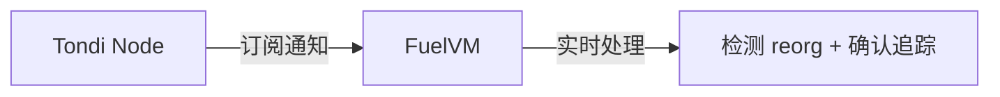
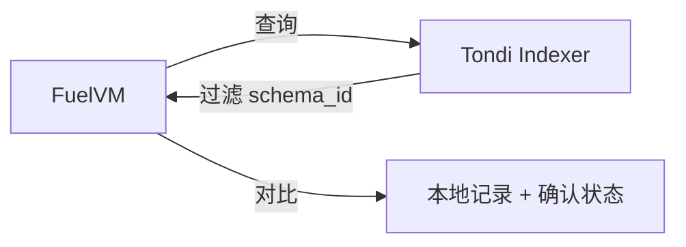
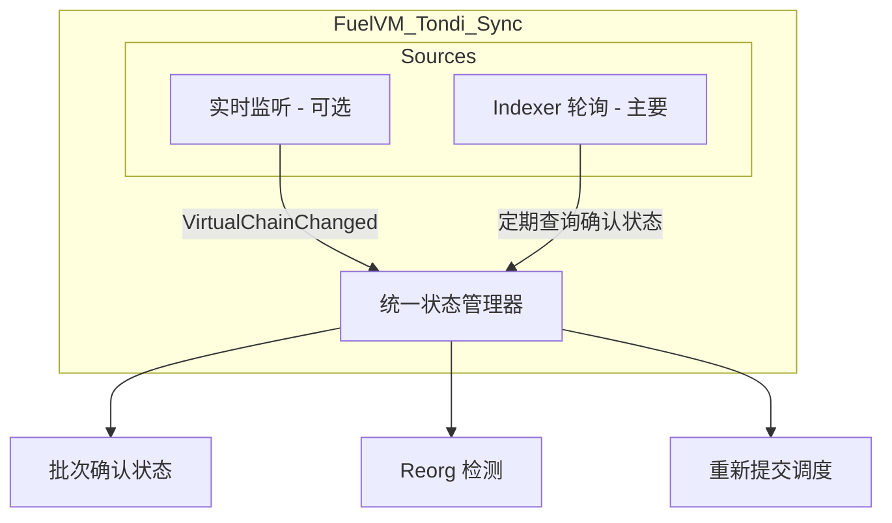
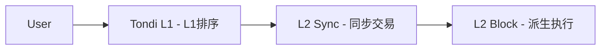
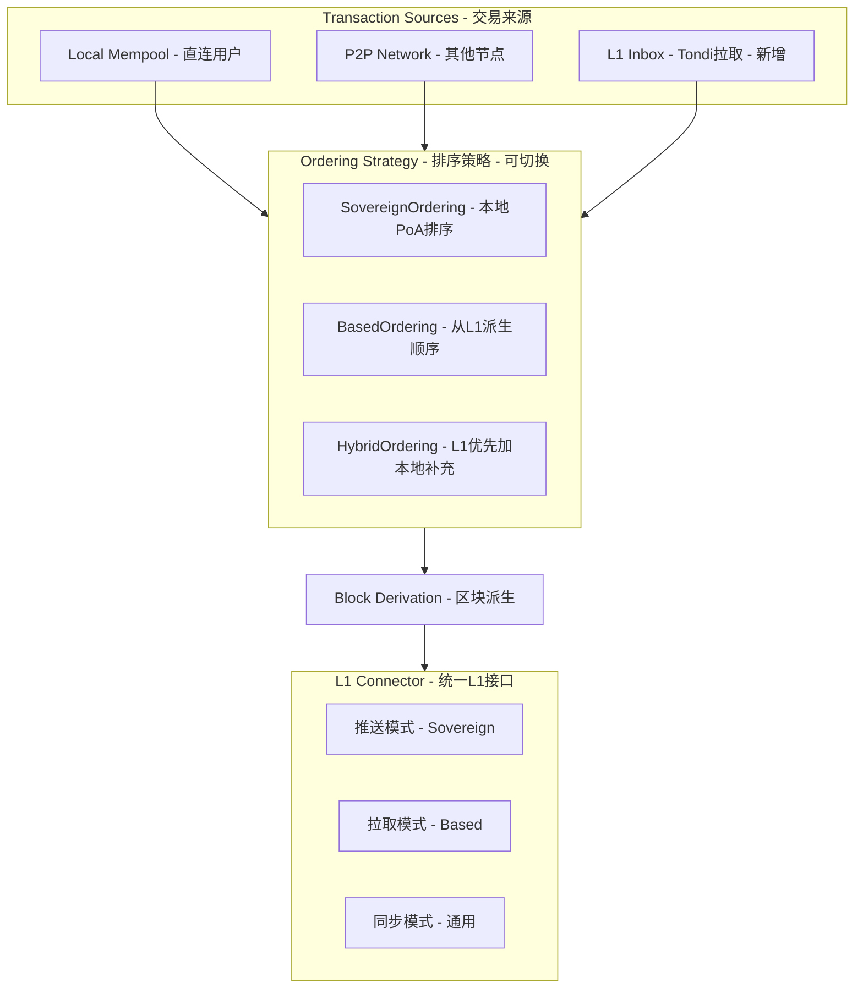
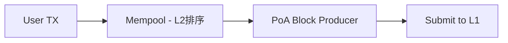
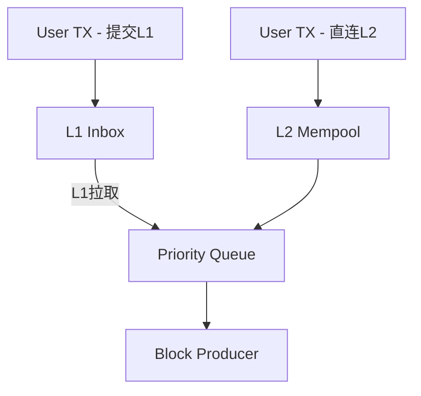
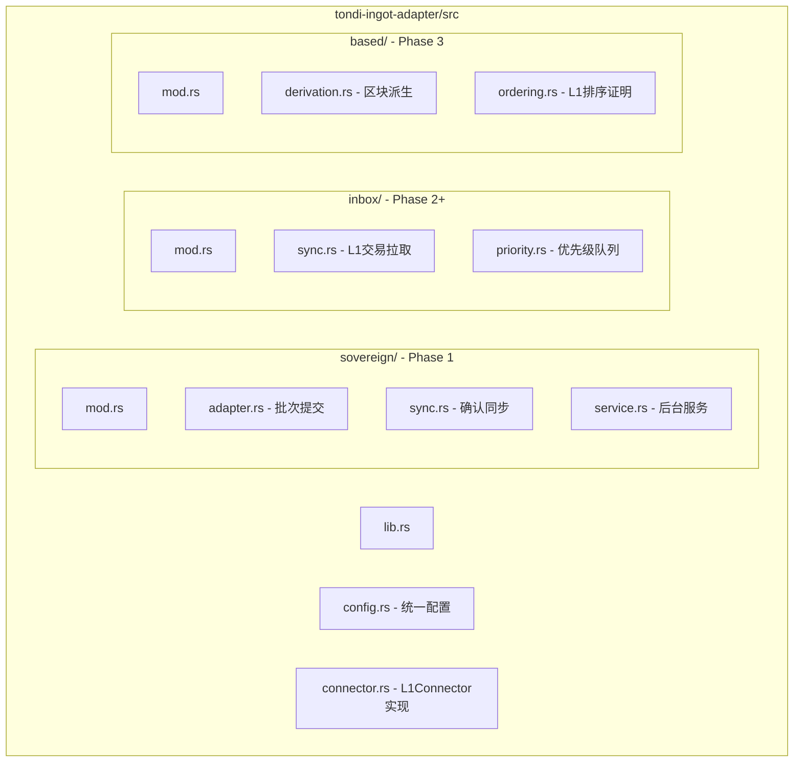

# L1-L2 Reorg-Proof Sync Paradigms

## 方案对比

### 方案 A：VirtualChainChanged 通知监听 - 主动推送



### 方案 B：Ingot Indexer 查询 - 被动拉取



---

## 关键差异

| 维度 | 通知监听 - 方案 A | Indexer 查询 - 方案 B |
|----|----|----| 
| **实时性** | 实时，毫秒级 | 轮询延迟，秒级 |
| **复杂度** | 需要处理通知流、状态机 | 简单的 REST/gRPC 查询 |
| **Reorg 检测** | 主动通知 removed_chain_block_hashes | 需要对比历史记录推断 |
| **依赖** | 需要 WebSocket/gRPC 订阅连接 | 只需 HTTP 查询 |
| **恢复能力** | 断线后需要重新同步 | 无状态，随时可查 |
| **幂等性** | 需要自己维护 | Indexer 天然幂等 |

---

## Indexer 方案设计

如果使用 Indexer 方案，设计会更简洁：

```rust
/// 基于 Indexer 的同步服务
pub struct TondiIndexerSync {
    /// Tondi RPC 客户端
    tondi_rpc: TondiRpcClient,
    /// FuelVM 的 schema_id
    schema_id: Hash,
    /// 最后确认的批次号
    last_confirmed_batch: u64,
    /// 轮询间隔
    poll_interval: Duration,
}

impl TondiIndexerSync {
    /// 同步循环
    async fn sync_loop(&mut self) -> anyhow::Result<()> {
        loop {
            // 1. 查询 Indexer：获取所有 confirmed 的 FuelVM Ingot
            let confirmed_ingots = self.tondi_rpc
                .get_ingots_by_schema(
                    &self.schema_id,
                    self.last_confirmed_batch + 1,
                    None,
                    ConfirmationLevel::Finalized,
                )
                .await?;
            
            // 2. 处理确认的批次
            for ingot in confirmed_ingots {
                let batch_num = self.extract_batch_number(&ingot)?;
                self.mark_batch_finalized(batch_num, ingot.block_hash)?;
                self.last_confirmed_batch = batch_num;
            }
            
            // 3. 检查是否有未确认的批次
            self.check_orphaned_batches().await?;
            
            tokio::time::sleep(self.poll_interval).await;
        }
    }
    
    /// 检查孤立批次
    async fn check_orphaned_batches(&mut self) -> anyhow::Result<()> {
        let pending_batches = self.storage.get_pending_batches()?;
        
        for batch in pending_batches {
            if batch.submitted_at.elapsed() > self.orphan_timeout {
                match self.tondi_rpc.get_transaction_status(batch.txid).await? {
                    TxStatus::NotFound => {
                        self.schedule_resubmission(batch.batch_number).await?;
                    }
                    TxStatus::InMempool => {}
                    TxStatus::Rejected(reason) => {
                        tracing::error!(batch = batch.batch_number, %reason, "Batch rejected");
                        self.schedule_resubmission(batch.batch_number).await?;
                    }
                    _ => {}
                }
            }
        }
        Ok(())
    }
}
```

---

## 两种方案可以结合

实际上，最稳健的设计是 **结合两种方案**：



**分工**：

* **Indexer 轮询**：主要确认机制，可靠、无状态、易于实现
* **通知监听**：可选的优化，用于快速 reorg 检测

---

## 推荐方案

对于 **MVP 阶段**，建议使用 **Indexer 方案**，因为：

1. **实现简单**：只需 HTTP 查询，无需维护 WebSocket 连接
2. **恢复容易**：节点重启后直接从 Indexer 同步
3. **调试方便**：可以手动查询 Indexer 验证状态
4. **依赖少**：不需要 Tondi 的通知订阅功能

```rust
// MVP 配置
pub struct TondiSyncConfig {
    /// 轮询间隔 - 建议 2-6 秒
    pub poll_interval: Duration,
    /// 认为批次孤立的超时时间 - 建议 30-60 秒
    pub orphan_timeout: Duration,
    /// 最大重试次数
    pub max_resubmit_attempts: u8,
}

impl Default for TondiSyncConfig {
    fn default() -> Self {
        Self {
            poll_interval: Duration::from_secs(3),
            orphan_timeout: Duration::from_secs(45),
            max_resubmit_attempts: 3,
        }
    }
}
```

---

# Sovereign → Based Rollup 演进路径

## 两种模式的核心差异

### Sovereign Rollup - 现阶段


**特点**：L2 完全控制排序，L1 只存数据

### Based Rollup - 未来



**特点**：L1 决定交易顺序，L2 是派生链

---

## 渐进式架构设计



---

## 核心抽象接口

```rust
/// 排序模式
#[derive(Debug, Clone, Copy)]
pub enum OrderingMode {
    /// Sovereign: L2 完全控制排序
    Sovereign,
    /// Based: L1 决定排序
    Based,
    /// Hybrid: L1 优先，允许 L2 补充
    Hybrid { 
        l1_priority: bool,
        l2_fallback_timeout: Duration,
    },
}

/// 交易来源
#[derive(Debug, Clone)]
pub enum TransactionSource {
    /// 本地 mempool
    LocalMempool,
    /// P2P 网络
    P2PGossip,
    /// L1 Inbox - Based Rollup 使用
    L1Inbox { l1_block: u64, l1_tx_index: u32 },
}

/// 排序提供者 trait - 核心抽象
#[async_trait]
pub trait OrderingProvider: Send + Sync {
    async fn get_pending_transactions(&self) -> Vec<(Transaction, TransactionSource)>;
    fn get_ordering_proof(&self) -> OrderingProof;
    fn mode(&self) -> OrderingMode;
}

/// L1 连接器 trait - 统一接口
#[async_trait]
pub trait L1Connector: Send + Sync {
    // 推送模式 - Sovereign
    async fn submit_batch(&self, batch: &FuelBlockBatch) -> Result<L1TxId>;
    async fn get_batch_status(&self, batch_id: u64) -> Result<BatchL1Status>;
    
    // 拉取模式 - Based
    async fn get_inbox_transactions(
        &self,
        from_l1_height: u64,
        to_l1_height: Option<u64>,
    ) -> Result<Vec<L1InboxTransaction>>;
    async fn get_l1_state(&self) -> Result<L1State>;
    
    // 通用
    async fn sync_to_height(&self, height: u64) -> Result<()>;
}
```

---

## 三阶段演进计划

### Phase 1: Pure Sovereign - 当前实现



**实现**: TondiIngotAdapter - 推送模式  
**功能**: 批量提交、确认追踪、reorg 处理

### Phase 2: Hybrid Mode - 过渡阶段



**新增**: L1InboxSync 服务  
**功能**: 从 L1 拉取用户直接提交的 FuelVM 交易  
**优先级**: L1 交易优先处理，确保 Based 语义

### Phase 3: Pure Based - 最终目标


**实现**: TondiDerivationPipeline  
**功能**: 从 L1 派生区块，完全基于 L1 排序

---

## L1 Inbox 设计 - 为 Based 模式准备

```rust
/// L1 Inbox 交易格式 - 用户直接提交到 Tondi 的 FuelVM 交易
pub struct L1InboxTransaction {
    pub l1_block_height: u64,
    pub l1_tx_index: u32,
    pub l1_daa_score: u64,
    pub fuel_tx: Transaction,
    pub l1_sender: TondiAddress,
}

/// L1 Inbox 同步服务 - Phase 2/3 使用
pub struct L1InboxSync {
    tondi_connector: Arc<dyn L1Connector>,
    last_synced_l1_height: u64,
    pending_l1_txs: VecDeque<L1InboxTransaction>,
}

impl L1InboxSync {
    async fn sync(&mut self) -> anyhow::Result<Vec<L1InboxTransaction>> {
        let current_l1_height = self.tondi_connector.get_l1_state().await?.height;
        
        if current_l1_height > self.last_synced_l1_height {
            let new_txs = self.tondi_connector
                .get_inbox_transactions(
                    self.last_synced_l1_height + 1,
                    Some(current_l1_height),
                )
                .await?;
            
            self.last_synced_l1_height = current_l1_height;
            self.pending_l1_txs.extend(new_txs.clone());
            
            Ok(new_txs)
        } else {
            Ok(vec![])
        }
    }
}
```

---

## 配置驱动的模式切换

```rust
/// Tondi 集成配置
#[derive(Debug, Clone)]
pub struct TondiConfig {
    pub rpc_url: Url,
    pub ordering_mode: OrderingMode,
    pub sovereign: Option<SovereignConfig>,
    pub based: Option<BasedConfig>,
}

#[derive(Debug, Clone)]
pub struct SovereignConfig {
    pub submission_interval: Duration,
    pub max_batch_size: u32,
    pub finality_confirmations: u8,
}

#[derive(Debug, Clone)]
pub struct BasedConfig {
    pub l1_sync_delay_blocks: u64,
    pub inbox_schema_id: Hash,
    pub allow_local_txs: bool,
}
```

---

## CLI 参数设计

```bash
# Phase 1: Sovereign 模式 - 当前
fuel-core run \
  --enable-tondi \
  --tondi-mode sovereign \
  --tondi-submission-interval 12s

# Phase 2: Hybrid 模式 - 过渡
fuel-core run \
  --enable-tondi \
  --tondi-mode hybrid \
  --tondi-l1-priority \
  --tondi-allow-local-txs

# Phase 3: Based 模式 - 未来
fuel-core run \
  --enable-tondi \
  --tondi-mode based \
  --tondi-sync-delay-blocks 6 \
  --tondi-inbox-schema-id <hash>
```

---

## 文件结构演进



---

## 总结

| 阶段 | 模式 | 主要实现 | 切换方式 |
|----|----|----|----|
| **Phase 1** | Sovereign | TondiIngotAdapter 推送批次 | 当前 |
| **Phase 2** | Hybrid | 新增 L1InboxSync 拉取 + 优先级 | 配置切换 |
| **Phase 3** | Based | 新增 DerivationPipeline | 配置切换 |

**关键设计原则**：

1. **接口抽象**：L1Connector 和 OrderingProvider 隔离模式差异
2. **配置驱动**：通过配置切换模式，无需代码改动
3. **增量实现**：Phase 1 完成后，Phase 2/3 是增量添加
